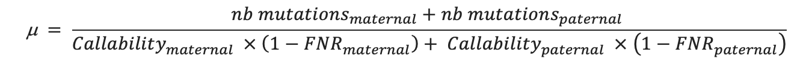

## Content
- Manually improve the assembly
- Detect genetic diversity between maternal and paternal
- Annntate variants
- De novo mutation
- Identification of positively selected genes (PSGs)
- Compare diabetes-related genes among four species


### Manually improve the assembly

Anchor more scaffolds onto chromosomes and prepare data to identify SVs


#### Align maternal to paternal using mummer(nucmer)


```shell
mat=GCA_011750645.1_mArvNil1.mat_genomic.fna
pat=GCA_011762545.1_mArvNil1.pat_genomic.fna
p="Nile_Rat"
/share/app/MUMmer3.23/nucmer -maxmatch -l 100 -c 500 -p $p $mat $pat
/share/app/MUMmer3.23/delta-filter -m -i 90 -l 100 $p.delta > $p.delta.filt
/share/app/MUMmer3.23/dnadiff -d $p.delta -p $p.diff

```
This is a rough comparison to find the coordinate information of two assemblies quickly. Once we have found the missing scaffolds, we can link them up and detect genetic variations precisely.

#### Overall alignment

visualization of alignments

only keep scaffolds with length > 500 kb, and aligned block length > 10 kb

```
awk '($5>=10000||$6>=10000) && $7>98 && ($8>=500000 && $9>=500000){print $12"\t"$1"\t"$2"\t"$13"\t"$3"\t"$4}' Nile_Rat.diff.1coords > Nile_Rat.10k.id98.link
python3 Nile_Rat/bin/preCircosLink.sort.py --link Nile_Rat.10k.id98.link --scaf_len all.lens --minL 500000 --minB 10000 --rate 0.5
```
>note: 'all.lens' contains the length of all scaffolds

#### show global pattern by circos

```
circos -conf circos.conf
```
show cirocs
 <center>Figure 1. maternal vs. paternal alignment</center>

manually adjust the order, ```vi karyotype.txt```
draw again using ```circos -conf circos.conf```

show circos again
 <center>Figure 2. maternal vs. paternal alignment with adjusted orders</center>


#### Trim alignments to generate continuous and confident blocks
 <center>Figure 3. preview of missing scaffolds</center>

> \* hypothetical chromosomes order indicated by descending length, not biological chromosomes
table file can find => assembly_stat.xlsx

because of duplications and misassembly, we need to trim some improper alignments to avoid false-positive. 

#### how to trim alignments
 <center>Figure 4. how to trim alignments</center>


As expected, most chromosomes, only have one maternal scaffold and only one paternal scaffold, with the very close length, such as 

```text
chr4,chr5,chr7,chr8,chr9,chr10,chr11,chr12,chr13,chr14,chr15,chr18,chr20,chr22,chr23,chr24,chr25,chr26,chr27,chr30
```
 <center>Figure 5. simple alignment, show chr4 as a case</center>

But other cases are slightly complex, like ```chr1,chr2,chr3,chr6,chr16,chr17,chr19,chr21,chr28,chr29,chr31```;

 <center>Figure 6. complex alignment, show chr1 as a case</center>


I found that chr6 is more complicated than other chrs, which could be a misassembly. However, I checked the breakpoints on the paternal #1 sequence, the pacbio reads aligned it continuously. so that is not likely to be a misassembly. thus, paternal #3 should be trimmed.

 <center>Figure 7. alignment of chr6</center>

 <center>Figure 8. check left breakpoint on paternal #1 </center>

 <center>Figure 9. check right breakpoint on paternal #1 </center>

#### link scaffolds as super scaffold
Now we can concatenate these scaffolds into one super scaffold by 1000 Ns

Note: The *.mat.makeup.agp (give chr1 as example）file looks like below, it will generate one super scaffold, with two scaffolds (JAAOME010000002.1 & JAAOME010000006.1) linked by 1000 Ns.

```
superscaffold_chr1.mat	1	147137239	1	W	JAAOME010000002.1	1	147137239	-
superscaffold_chr1.mat	147137240	147138239	2	N	NA	1	1000	+
superscaffold_chr1.mat	147138240	255412214	3	W	JAAOME010000006.1	1	108273975	-
```

```
# make up the maternal super scaffold
python3 Nile_Rat/bin/link2superscaf.py chr1.mat.fa chr1.mat.makeup.agp  > chr1.mat.superscaf.fa
python3 Nile_Rat/bin/link2superscaf.py chr1.pat.fa chr1.pat.makeup.agp  > chr1.pat.superscaf.fa

```

#### Preparation for detecting structural variations

For these chromosomes, the script ```link2superscaf.py``` utility can be used in such cases to generate pseudo-chromosomes. It can generate pseudo-genomes using the homology of an incomplete genome with the reference (chromosome-level assembled) genome as well as using the homology between two incomplete assemblies.
(why I do this? [see more](https://schneebergerlab.github.io/syri/scaforder.html)) 

Now we have detected the missing scaffolds and anchored them to chromosome, then we can identify the large structural variations by comparing the maternal and paternal assemblies.


#### Sources

- avaliable codes, see [github page](https://github.com/comery/Nile_rat)
- *.agp files for making up super scaffolds, see "agp/all.makeup.agp"
- synteny plots for each chromosomes in this folder => synteny_comparison_figures


### Detect genetic diversity between maternal and paternal

#### Get the gene annotation for paternal and maternal assemblies

We compared the maternal and paternal assemblies to detect the full spectrum of genetic diversity. however, we only have the gene annotation of Refseq of Nile rat assembly (pat+X), so we need to generate the annotation for haploid assemblies by liftovering gene feature from Refseq based on genome alignment.

code avaliable:
download scripts form github repo [Nile_rat](https://github.com/comery/Nile_rat)
```shell
bin="/your_path/Nile_rat/bin"
```

#### liftover

gene features of Refseq:

```shell
grep -v '#' Nile_Rat/01.assembly/pat.X/GCF_011762505.1_mArvNil1.pat.X_genomic.gff |awk '$3=="mRNA" {print $1"\t"$4"\t"$5}' |uniq |awk '{print $0"\tg"NR}' > refseq.mRNA.bed
grep -v '#' Nile_Rat/01.assembly/pat.X/GCF_011762505.1_mArvNil1.pat.X_genomic.gff |awk '$3=="CDS" {print $1"\t"$4"\t"$5}' |uniq |awk '{print $0"\tcds"NR}' > refseq.cds.bed
```

liftover

```shell
liftOver refseq.mRNA.bed Nile_Rat/01.assembly/liftover/pat_as_query/refseq_vs_pat.chain pat.makeup.mRNA.bed pat.makeup.unMapped.mRNA.bed
liftOver refseq.cds.bed Nile_Rat/01.assembly/liftover/pat_as_query/refseq_vs_pat.chain pat.makeup.cds.bed pat.makeup.unMapped.cds.bed
liftOver refseq.mRNA.bed Nile_Rat/01.assembly/liftover/mat_as_query/refseq_vs_mat.chain mat.makeup.mRNA.bed mat.makeup.unMapped.mRNA.bed
liftOver refseq.cds.bed Nile_Rat/01.assembly/liftover/mat_as_query/refseq_vs_mat.chain mat.makeup.cds.bed mat.makeup.unMapped.cds.bed
```


#### Detect genetic diversity

make chr1 as an example 

```
software='/path/your_software_installed'
$software/MUMmer3.23/nucmer --maxmatch -c 500 -b 500 -l 100 chr1.pat.fa chr1.mat.fa -p chr1
$software/MUMmer3.23/delta-filter -m -i 90 -l 100 chr1.delta > chr1.delta.filt
$software/MUMmer3.23/show-coords -THrd chr1.delta.filt > chr1.delta.filt.coords
```

#### SNV & small indel using Mummer
```shell
$software/MUMmer3.23/dnadiff -d chr1.delta.filt -p chr1
mv chr1.snps chr1.var
python3  $bin/split_mummerVar2snpAndindel.py chr1.var chr1
python3 $bin/indel_statistic.py chr1.indel
awk '\$7<=50' chr1.indel.report.txt >chr1.mummer.sm.indel

```

#### SV (INV, TRANS, INVTR) using [Syri](https://schneebergerlab.github.io/syri/)

```shell
$software/syri-1.0/syri/bin/syri -c chr1.delta.filt.coords -r chr1.pat.superscaf.fa -q chr1.mat.superscaf.fa -d chr1.delta.filt
# output files: syri.out, syri.log, syri.vcf

# filter by gap ratio (remove records with N's ratio > 0.5)
python3 $bin/filterN_syri_variants.py syri.out chr1.pat.fa chr1.mat.fa > chr1.syri.sv.tab
```

#### large indel & cnv using [Assemblytics](https://github.com/MariaNattestad/Assemblytics)

```shell
# Assemblytics delta output_prefix unique_length_required min_size max_size
$software/Assemblytics-1.2.1/scripts/Assemblytics chr1.1delta chr1 10000 50 500000 && echo  done!
# filter by gap ratio (remove records with N's ratio > 0.5)
python3 $bin/filterN_assemblytics_variants.py chr1.Assemblytics_structural_variants.bed chr1.pat.fa chr1.mat.fa 0.5 >chr1.Assemblytics_structural_variants.filterN.bed
```


### Annntate variants

#### how to define that a gene affact by a variant?
I will think a variant may affact the gene if it has overlap with maternal gene features or has overlap with paternal gene features.


#### SNV
```shell
#cat ../list |while read a;do cat ../chromosomes/$a/$a.snp ;done > all.snp
echo "total snp count: " > summary.txt
wc -l all.snp >> summary.txt

# convert snp to bed format
awk '{print $11"\t"$1"\t"$1"\t"$12"\t"$4"\t"$4"\t"$2"\t"$3}' all.snp > all.snp.bed
cut -f 1-3 all.snp.bed > all.pat.snp.bed
cut -f 4-6 all.snp.bed > all.mat.snp.bed

# overlap with gene and cds
mat_mrna=Nile_rat/01.assembly/liftover/mat.makeup.mRNA.bed
pat_mrna=Nile_rat/01.assembly/liftover/pat.makeup.mRNA.bed
mat_cds=Nile_rat/01.assembly/liftover/mat.makeup.cds.bed
pat_cds=Nile_rat/01.assembly/liftover/pat.makeup.cds.bed

# overlap with mRNA
bedtools intersect -a all.pat.snp.bed  -b  $pat_mrna -wa -wb -loj  | bedtools groupby -i - -g 1-3 -c 7 -o collapse > pat.snp.mrna.overlap.bed
bedtools intersect -a all.mat.snp.bed  -b  $mat_mrna -wa -wb -loj  | bedtools groupby -i - -g 1-3 -c 7 -o collapse > mat.snp.mrna.overlap.bed
python3 $bin/combine_sv.annot.py all.snp.bed pat.snp.mrna.overlap.bed mat.snp.mrna.overlap.bed >all.snp.mRNA.annot
# either feature in paternal side is within a gene or feature in maternal side is within a gene, it will count
awk '$4!="." || $8!="."' all.snp.mRNA.annot > all.snp.annot.mRNA.overlap.txt


# overlap with cds
bedtools intersect -a all.pat.snp.bed  -b  $pat_cds -wa -wb -loj  | bedtools groupby -i - -g 1-3 -c 7 -o collapse > pat.snp.cds.overlap.bed
bedtools intersect -a all.mat.snp.bed  -b  $mat_cds -wa -wb -loj  | bedtools groupby -i - -g 1-3 -c 7 -o collapse > mat.snp.cds.overlap.bed
python3 $bin/combine_sv.annot.py all.snp.bed pat.snp.cds.overlap.bed mat.snp.cds.overlap.bed >all.snp.cds.annot
# either feature in paternal side is within a CDS or feature in maternal side is within a CDS, it will count
awk '$4!="." || $8!="."' all.snp.cds.annot > all.snp.annot.cds.overlap.txt

echo "SNV within mRNA:" >> summary.txt
wc -l all.snp.annot.mRNA.overlap.txt >> summary.txt

echo "SNV within CDS:" >> summary.txt
wc -l all.snp.annot.cds.overlap.txt >> summary.txt
```

#### small indels

```shell
cat ../../list |while read a;do cat ../../chromosomes/$a/$a.mummer.sm.indel  ;done > all.mummer.sm.indel
# convert file format
python3 $bin/small_indel_Pos2bed.py all.mummer.sm.indel

bedtools intersect -a ins.mat.pos.bed  -b  $mat_mrna -wa -wb  | bedtools groupby -i - -g 1-3 -c 7 -o collapse> ins.matPos.mRNA.bed
bedtools intersect -a del.pat.pos.bed  -b  $pat_mrna -wa -wb  | bedtools groupby -i - -g 1-3 -c 7 -o collapse> del.patPos.mRNA.bed

bedtools intersect -a ins.mat.pos.bed  -b  $mat_cds -wa -wb   | bedtools groupby -i - -g 1-3 -c 7 -o collapse> ins.matPos.cds.bed
bedtools intersect -a del.pat.pos.bed  -b  $pat_cds -wa -wb   | bedtools groupby -i - -g 1-3 -c 7 -o collapse> del.patPos.cds.bed

```

#### SV

```shell
cat ../../list |while read a;do cat ../../chromosomes/$a/assemblytics/$a.Assemblytics_structural_variants.filterN.bed  ;done > all.Assemblytics_structural_variants.filterN.bed
grep 'Insertion' all.Assemblytics_structural_variants.filterN.bed > all.Insertion.bed
grep 'Deletion' all.Assemblytics_structural_variants.filterN.bed > all.Deletion.bed
grep -v -e 'Insertion' -e 'Deletion' all.Assemblytics_structural_variants.filterN.bed > all.cnv.bed

echo "total:" >readme.txt
wc -l all.Assemblytics_structural_variants.filterN.bed >> readme.txt

# overlap with mRNA
cut -f 1-3 all.Assemblytics_structural_variants.filterN.bed > pat.sv.bed
cut -f 4-6 all.Assemblytics_structural_variants.filterN.bed > mat.sv.bed
bedtools intersect -a pat.sv.bed  -b  $pat_mrna -wa -wb -loj  | bedtools groupby -i - -g 1-3 -c 7 -o collapse > pat.sv.mrna.overlap.bed
bedtools intersect -a mat.sv.bed  -b  $mat_mrna -wa -wb -loj  | bedtools groupby -i - -g 1-3 -c 7 -o collapse > mat.sv.mrna.overlap.bed
python3 $bin/combine_sv.annot.py all.Assemblytics_structural_variants.filterN.bed pat.sv.mrna.overlap.bed mat.sv.mrna.overlap.bed >all.Assemblytics_structural_variants.filterN.mRNA.annot
awk '$4!="." || $8!="."' all.Assemblytics_structural_variants.filterN.mRNA.annot > all.Assemblytics_structural_variants.filterN.annot.mRNA.overlap.txt
echo "overlap with mRNA" >> readme.txt
cut -f 9 all.Assemblytics_structural_variants.filterN.annot.mRNA.overlap.txt|sort |uniq -c |sort -rn >> readme.txt

# overlap with cds
bedtools intersect -a pat.sv.bed  -b  $pat_cds -wa -wb -loj  | bedtools groupby -i - -g 1-3 -c 7 -o collapse > pat.sv.cds.overlap.bed
bedtools intersect -a mat.sv.bed  -b  $mat_cds -wa -wb -loj  | bedtools groupby -i - -g 1-3 -c 7 -o collapse > mat.sv.cds.overlap.bed
python3 $bin/combine_sv.annot.py all.Assemblytics_structural_variants.filterN.bed pat.sv.cds.overlap.bed mat.sv.cds.overlap.bed >all.Assemblytics_structural_variants.filterN.cds.annot
awk '$4!="." || $8!="."' all.Assemblytics_structural_variants.filterN.cds.annot > all.Assemblytics_structural_variants.filterN.annot.cds.overlap.txt
echo "overlap with CDS" >> readme.txt
cut -f 9 all.Assemblytics_structural_variants.filterN.annot.cds.overlap.txt|sort |uniq -c |sort -rn >> readme.txt
```

#### Statistics

finally, the number of all kinds of variants can be found => [tab](variants.statistics.xlsx)

Summary of genetic diversity

| variant type | number |
| --- | --- |
| snv | 2,512,582 |
| small indel (<= 50 bp) | 1,252,719 |
| large indel (> 50 bp)| 9,244 |
| inversion | 54 |
| translocation  | 95 |
| inverted translocation  | 62 |
| cnv | 1,971 |


### De novo mutation

Estimation of germline mutation rte in the nile rat:

#### Methods

The offspring and parental reads were mapped to each assembly independently (paternal and maternal). Duplicate reads and reads mapping to more than one region were removed. Variants were called using GATK 4.0.7 HaplotypeCaller in base-pair resolution mode, calling each single sites of the genome. Two independent joint genotyping were produced: one for the 3 individuals (mother, father, offspring) mapped to the maternal assembly and one for the 3 individuals mapped to the paternal assembly. The variant file was filter on the quality of the genotyping following these parameters: QD < 2.0, FS > 20.0, MQ < 40.0, MQRankSum < -2.0, MQRankSum > 4.0, ReadPosRankSum < -3.0, ReadPosRankSum > 3.0, SOR > 3.0.

We then identified the maternal de novo candidates using the following genotypes:
	
- sites where the parents are homozygote for the reference (0/0) and the offspring is heterozygote (0/1) when mapped to the paternal genome: 35 candidates
- sites where the parents are homozygote for the alternative (1/1) and the offspring is heterozygote (0/1) when mapped to the maternal genome: 133 candidates
- 
A comparison of the reads in the candidates sites resulted in only 1 position with an overlap of reads name. Thus, we found 1 maternal de novo candidate mutations. 
Similarly, we identified the paternal de novo candidates using the following genotypes:

- sites where the parents are homozygote for the reference (0/0) and the offspring is heterozygote (0/1) when mapped to the maternal genome: 38 candidates
- sites where the parents are homozygote for the alternative (1/1) and the offspring is heterozygote (0/1) when mapped to the paternal genome: 143 candidates

The comparison of reads in both dataset resulted in 3 positions with overlapping reads. Thus, we retained 3 paternal de novo candidate mutations. 

Additional filters were applied at each position to detect the candidate mutations. Thus, a site would be filtered out if one individual would have:

- a depth DP < 0.5 × depth individual and DP > 2 × depth individual , with depth individual being the average depth of the individual (depth individual offspring: 56 X, depth individual father: 78 X and depth individual mother: 84 X). 
- a genotype quality GQ < 60. 
- an number of alternative allele in the parents AD > 0. 
- an allelic balance in the offspring AB < 0.3 and AB > 0.7. 

To estimate a per generation rate, we calculated a callability, the number of site with full detection power. These were all the sites that passed the DP, the GQ and the AD filters. The maternal callability was 1,371,536,436 base pairs and the paternal callability was 1,365,805,112 base pairs. This callability estimation does not take into account the filters applied only on polymorphic sites that could have reduce the detection power on some of the callable sites. To correct for any bias due to the site filters and the allelic balance filter we applied a false negative rate (FNR) correction on the callability. The FNR was calculated as the number of true heterozygote sites, i.e. one parent homozygote for the reference allele, one parent homozygote for the alternative allele and the offspring heterozygote, filtered away by the AB filter. This FNR also took into account the proportion of callable sites expected to be filtered away by the site filters if a variant was present. FNR was ~ 5 % on both the maternal and paternal assembly. 
Finally, we estimated a rate using:



#### Results

We found 4 de novo candidate mutations in the trio of Nile rate, with 1 mutation from maternal origin and 3 from paternal origin, suggesting as in other mammals, a male bias in the contribution of germline mutations. With a few mutations detected the mutation rate of the species was estimated at 0.15 × 10-8 mutations per site per generation. 


### Identification of PSGs

#### Date usage
I downloaded the rat RefSeq genome (GCF_015227675.2_mRatBN7.2_genomic.fna.gz), and the mouse RefSeq genome (GCF_000001635.27_GRCm39_genomic.fna.gz) for downstream analysis.

#### Annotation method
I did not retrieve the genes and protein sequences from NCBI GFF data, instead, I did the reannotation for the rat, mouse, and Nile rat using human protein as reference.
Although the RefSeq version has a very detailed annotation, isoforms they reported will make it problematic to identify orthologous genes among four species. It could happen that an isoform is a positively selected gene (PSG), but not in another isoform of the same gene. So, the simplest way to avoid this problem is to reannotate genes using the same standard pipeline. This issue was also raised by one of reviewers of the marmoset paper.

To achieve this goal, I generated a dataset of 20,426 genes of human by selecting the longest transcript as the representative transcript. Then annotated rat, mouse, and Nile rat genomes using [exonerate](https://www.ebi.ac.uk/about/vertebrate-genomics/software/exonerate). Thanks to the good performance exonerate, I got a dataset of 19,856 orthologous gene groups to conduct PSG detection.


#### Preparation of multiple sequence alignment

For an orthologous gene, protein alignment will conduct at first, then protein sequence alignment will guide nucleotide sequence alignment to make sure alignment is based on codon.

First, each included gene had to map to the human sequence alignments including at least 70% of its coding sequence (CDS). Second, frameshift indels in CDSs were prohibited. Third, CDSs with premature stop codons were excluded. In addition, final alignments shorter than 150 bp were discarded. After filtering,
a total of 13,622 genes were recovered.

#### Identification positively selected gene

The positive selection sites within a specific lineage were detected by the branch-site model in PAML. Genes with an FDR-adjusted p-value less than 0.05 were treated as candidates for positive selection. To minimize the effects of assembly and alignment, we filtered candidate PSGs if 1) the positive selective site was gap in more than two species; 2) the PS sites have more than two nonsynonymous substitution forms.

finally, we got 497 PSGs, containing 68 diabetes-related genes. I did the GO term and KEGG enrichment by [gProfiler](https://biit.cs.ut.ee/gprofiler/gost) and [Kobas](http://kobas.cbi.pku.edu.cn/). You can find the results in folder (PSGs/significant).


#### code for analysis

##### annnotation

make rat genome as an example

```shell
genome="GCF_015227675.2_mRatBN7.2_genomic.fna"
shortname="mRatBN"
[ -d $shortname ] || mkdir $shrotname
cd $shortname
ln -s ../$genome ./$shortname.fa
$software/exonerate-2.4.0/bin/exonerate --model protein2genome --bestn 1 --showalignment TRUE --showtargetgff TRUE --showvulgar TRUE ../homo_sapiens.best.pep $shortname.fa >$shortname.exonerate
python3 bin/exonerate_parse.py ../homo_sapiens.best.pep $shortname.exonerate ./
perl bin/getGene.pl $shortname.exonerate.gff $shortname.fa | awk '{print \$1}' > $shortname.exonerate.cds
fastaKit -ap $shortname -o tmp $shortname.exonerate.cds
mv tmp $shortname.exonerate.cds
perl bin/cds2aa.pl $shortname.exonerate.cds | awk '{print \$1}' > $shortname.exonerate.pep
date"
```

annotate other species using above pipeline, and then merge all cds together (all.cds)

```shell
# add a tag to human sequence's header
bin/fastaKit -ap human -o human.cds homo_sapiens.best.cds

# merge all cds together
find ../01.annot/ -name "*.exonerate.cds" |xargs cat > tmp
cat human.cds tmp > all.cds

# split sequences into subdir by ortholog
python3 ../../bin/getMSAfromCDS.py all.cds MSA

# remove these orthologs which has gene missing at least one species
grep -v  '#' ortholog.matrix.txt|awk '$2!="na"'|cut -f 1,2 > all.right.ortholog.list

# protein alignment
wk=`pwd`
cat all.right.ortholog.list|while read a b
do
	cd $b
	perl $bin/cds2aa.pl $a.cds > $a.pep
	$software/mafft/7.471/bin/mafft --anysymbol --maxiterate 1000 --localpair --quiet --thread 2 $a.pep > $a.pep.aln
	perl $bin/pepMfa_to_cdsMfa.pl $a.pep.aln $a.cds > $a.cds.aln
	perl $bin/pal2nal.pl  $a.pep.aln  $a.cds -output paml -nogap > pal2nal.seq
	cp $wk/codeml.ctl .
	$software/paml-4.8/bin/codeml codeml.ctl
	python3 $bin/parse_codeml_output_raw.py codeml.txt > $a.pairwise.val0
	python3 $bin/parse_codeml_output.py codeml.txt > $a.pairwise.val

	cd $wk
done


# positively seleceted genes
# filter genes by alignment

## 1, each gene has more than 70% align rate with human
## 2, framshif, stop codon exclude
## 4, alignment < 150 bp, exclude

cat all.right.ortholog.list|while read a b
do
	# give a report
	python3 $bin/MSAexamine.py -minL 50 -rate 0.70 -rid human -a $b/$a.pep.aln -f tab
done > all.filter.report.tab

# keep filtered orthology
grep 'PASS' all.filter.report.tab|cut -f 1 >all.filtered.ortholog.list
python3 $bin/getLine_by_ColumnInTab.py all.right.ortholog.list 1 all.filtered.ortholog.list 1 >all.filtered.ortholog.path.list

# PSGs
wk=`pwd`
cat all.filtered.ortholog.path.list|while read a b
do
	python3 $bin/paml_single.py $wk/tree/tree.nwk $b/$a.cds.aln $b
	cd $b
	sh paml.sh
	cd $wk
done

# p-value
cat all.filtered.ortholog.path.list|while read a b
do
	perl $bin/paml.lrt.pl $b/H1.mlc $b/H0.mlc 1
done > all.ortholog.pvalue


# q-value
perl $bin/paml.fdr.pl all.ortholog.pvalue BH 0.05 > all.ortholog.qvalue

awk  '$3 == "significant" && $1==0 {print $2}' all.ortholog.qvalue > all.significant.gene

# visulization of phylogeny and alignment around each PSG site
[ -d "significant"  ] || mkdir "significant"
grep -f all.significant.gene all.filtered.ortholog.path.list > all.significant.gene.list
cd significant
cat ../all.significant.gene.list|while read a b
do
	ln -s ../$b ./
done
cd ..
find significant/ -type l >draw.og.list

cat draw.og.list|while read a
do
	b=`echo $a|awk -F "/" '{print $2}'`
	python3 $bin/draw_phytree_with_align_mlc.py $a/H1.mlc $a/$b.cds.aln paternal $b
done > draw.log
```

### Compare diabetes-related genes among four species

We have obtained the gene alignment and calculated the dnds values when conducting PSG analysis. now we can collect them to find diverse genes among four species.


```shell
# cat them together..., got 3054gene.pairwise.val0
awk '$3>1' 3054gene.pairwise.val0 |grep -e 'maternal' -e 'paternal' |grep -v 'nan' >Nile_rat.compared.val
# filter val
# do filtering, see reference
awk '$3<10 && $3>1 && $5 <2 && $5>0.01' Nile_rat.compared.val > Nile_rat.compared.filtered.val

```

#### reference
https://www.protocols.io/view/introduction-to-calculating-dn-ds-ratios-with-code-qhvdt66?version_warning=no&step=4